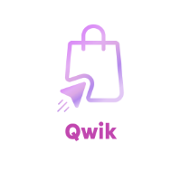
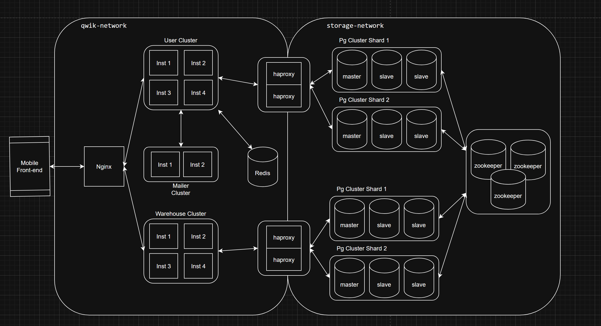

# Qwik

<div>
  
</div>

## Оглавление
- [Qwik](#qwik)
  - [Оглавление](#оглавление)
  - [Общее описание](#общее-описание)
  - [Стек технологий](#стек-технологий)
    - [Frontend](#frontend)
    - [Backend](#backend)
  - [Запуск](#запуск)
  - [API документация](#api-документация)

## Общее описание

Проект представляет собой агрегатор на подобии Amazon/Ozon/Wildberries.
Состоит из двух частей:

- Мобильного приложения под Android на C#
- Сервера на Golang и C#

Микросервисная схема:



## Стек технологий

### Frontend

- C#
- .NET MAUI
- REST API

### Backend

- Golang
- C#
- .NET
- Postgres
- zookeeper
- patroni
- Haproxy
- Redis
- gRPC
- GraphQL
- Nginx
- REST API
- Docker
- Swagger

## Запуск

Для запуска потребуется прописать эту при открытом Docker

```bash
docker build -t migrator ./Backend/infra/DbNomad/DbNomad
docker build -t patroni ./Backend/infra/Patroni
docker compose -f ./Backend/compose.yml up --build
```
Или
```bash
make run
```

## API документация

Документация доступна по адресам: